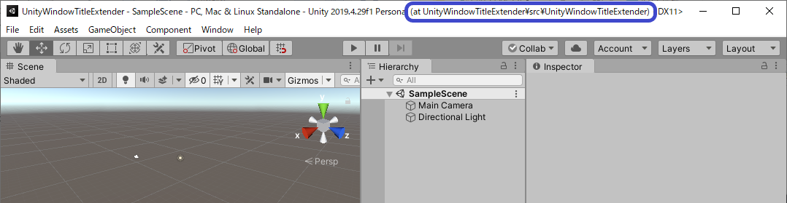

# UnityWindowTitleExtender

Shows parent directories on the title bar of the Unity Editor Window.

This is useful when you are working with multiple Unity Editor Windows and want to distinguish which is which.



# How to install to your project

1. Open Unity Package Manager Window.
2. From '+' button on the upper left corner, select `Add Packkage from Git URL...`.
3. Put this to the text box and click `Add`.
```
https://github.com/mhama/UnityWindowTitleExtender?path=/src/UnityWindowTitleExtender/Assets/UnityWindowTitleExtender
```
